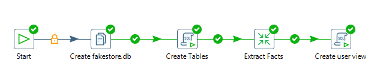
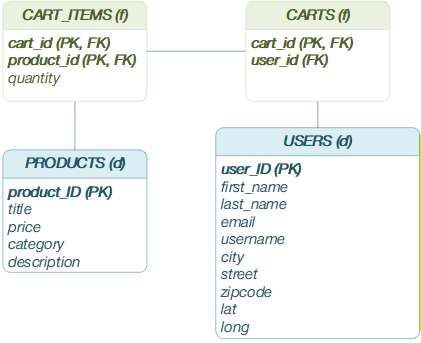

# FakeStore API ETL with Pentaho (PDI)

This project implements a complete ETL (Extract, Transform, Load) pipeline using **Pentaho Data Integration (Kettle)**. It extracts e-commerce data from the public [FakeStoreAPI](https://fakestoreapi.com/), transforms the hierarchical JSON structure into relational tables, and loads the data into a local **SQLite** database for downstream analytics.

## 1. Pipeline Overview

The orchestration is managed by the main job **`fakestore_job.kjb`**, which executes the following steps sequentially:

<p align="center">
  
</p>

1.  **Environment Setup:** Creates a clean `fakestore.db` file by copying a template (`empty.db`) to the target directory.
2.  **Schema Initialization:** Executes the `create_table.sql` script to build the database structure.
3.  **ETL Execution:** Triggers **`extract_dimensions.ktr`** and **`extract_facts.ktr`** transformations to ingest and process data.
4.  **Analytics Layer:** Executes `create_user_view.sql` to generate analytical views (e.g., user summaries).

## 2. Data Model

The data were arranged in a multidimensional model (star schema).

<p align="center">
  
</p>

| Table | Type |Description | Key Attributes |
| :--- | :--- | :--- | :--- |
| **`users`** | Dimension table | Customer dimension | `user_id`, `email`, `username`, `firstname`, `lastname`, `city`, `street`, `lat`, `long`. |
| **`products`** | Dimension table |  Product catalog | `product_id`, `title`, `price`, `category`, `description`. |
| **`carts`** | Fact table | A shopping cart associated with a user | `cart_id`, `user_id`. |
| **`cart_items`** | Fact table | The products associated with a shopping cart | `cart_id`, `product_id`, `quantity`. |

## 3. ETL processing (`extract_dimensions.ktr` and  `extract_facts.ktr`)

The ETL processing is made in  `extract_dimensions.ktr` and `extract_facts` transformations, which handles the API consumption and data normalization.

### Data Flow Strategy
1.  **Dimensions Extractions:** The process begins by fetching all users and products from the FakeAPI endpoint.
1.  **Facts Extraction:** All shopping carts are extracted from the `https://fakestoreapi.com/carts` endpoint. Each fact are associated with users and products dimensions by foreign keys.
3.  **Loading:** Data is inserted into the SQLite database.   
    *Note:* The pipeline handles duplicate handling using logic such as `INSERT OR IGNORE` for the `carts` table.


## 4. Real Time Data Flow Strategy (bonus!) (`extract_realtime_facts.ktr`)

In the previous approach, dimensions were inserted according to the entry of a fact. If the dimensions associated with a fact did not exist in the dimension tables, they were inserted on-the-fly. However, this can cause problems if the analyst wants to check users without shopping carts. Furthermore, the previous approach can be useful in cases where many facts are generated at the same time. Therefore, the `extract_realtime_facts.ktr` file was created based on this approach. This transformation can be executed without **`fakestore_job.kjb`**, as long as the tables already exist in the database.

### Data Flow Strategy
1.  **Carts Extraction:** The process begins by fetching all shopping carts from the `https://fakestoreapi.com/carts` endpoint.
2.  **Fact & Dimension Splitting:** Unique User and Product IDs are extracted from carts to dynamically generate  API URLs.
3.  **Enrichment:** The pipeline performs HTTP GET requests for every unique User and Product to fetch full details (Name, Address, Geo-coordinates, Product Category, etc.).
4.  **Loading:** Data is inserted into the SQLite database.
    *Note:* The pipeline handles duplicate handling using logic such as `INSERT OR IGNORE` for the `carts` table.

## 5. "Materialized view" for analytics

The `create_user_view.sql` file contains an SQL query that drops and creates the `user_analytics` table, acting as a materialized view of a more advanced DBMS like PostgreSQL, since SQLite does not support materialized views. This view table, grouped by user, allows the data analyst to use this data in a BI environment via OLAP queries. These OLAP queries include:
* Number of user shopping carts.
* Number of distinct products in all shopping carts (per user).
* Average quantity of products per cart, rounded.
* Number of different product categories purchased.
* Price of the user's most expensive product 
* Sum of the product prices (assuming one unit per product)

## 6. Getting Started

### Prerequisites
* **Java Runtime Environment (JRE)** 8 or higher.
* **Pentaho Data Integration (Spoon)** 8.0 or higher.

### Directory Structure
To ensure the relative paths (`${Internal.Entry.Current.Directory}`) work correctly, maintain this folder structure:

```text
/project-root
├── fakestore_job.kjb                # Main Job Entry Point
├── extract_dimensions.ktr           # ETL for dimensions tables (Required)
├── extract_facts.ktr                # ETL for fact tables (Required)
├── extract_realtime_facts.ktr       # ETL for fact and dimension tables in real-time approach
├── db/
│   ├── empty.db                     # Empty SQLite template (Required)
│   └── fakestore.db                 # Output database (Generated automatically)
└── sql/
    ├── create_table.sql             # DDL Script (Required)
    └── create_user_view.sql         # Analytics View Script (Required)
